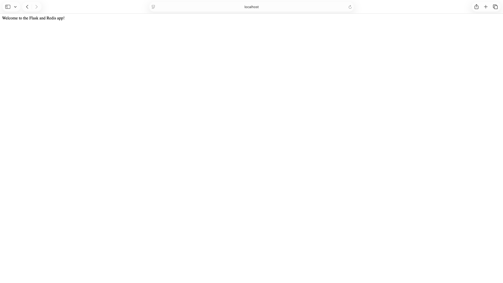
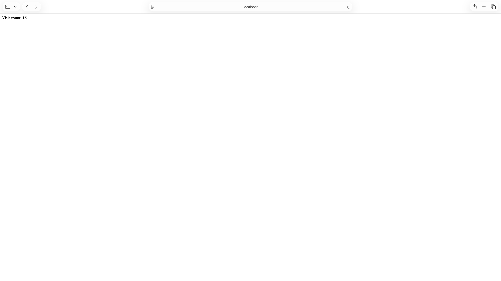

# 🐳 Flask + Redis + Nginx Multi-Container Application

## 📖 Overview

This project is a multi-container web application built using Docker. It consists of:

* **Flask** — Python web application
* **Redis** — In-memory key-value store
* **Nginx** — Reverse proxy and load balancer
* **Docker Compose** — Orchestration tool

The application demonstrates how multiple containers communicate, scale, and work together in a production-style setup.

---

## 🏗️ Architecture

The system is composed of three main services:

* **web (Flask)** — Handles HTTP requests
* **redis** — Stores visit count
* **nginx** — Reverse proxy and load balancer

**Request flow:**

1. User sends request to Nginx
2. Nginx forwards request to Flask
3. Flask updates/retrieves data from Redis
4. Response is returned to the user

---

## ⚙️ Features

* Multi-container architecture
* Scalable Flask application
* Shared Redis database
* Nginx load balancing
* Persistent data using Docker volumes

---

## 🔗 Endpoints

* `/` → Welcome page
* `/count` → Visit counter

---

## ▶️ How to Run

```bash
docker compose up --build
```

Scale the app:

```bash
docker compose up --scale web=3 --build
```

Access:

* http://localhost:5002
* http://localhost:5002/count

---

## 📸 Application Screenshots

### Home Page

The main landing page of the application.



---

### Visit Count

The counter increments on each refresh and is stored in Redis.



---

## 💾 Persistent Storage

Redis uses a Docker volume (`redis-data`) to persist data.

This ensures the visit count remains after restarting containers.

---

## 🌐 Nginx Reverse Proxy

Nginx is configured to:

* Listen on port **5002**
* Load balance across Flask containers
* Act as a single entry point

---

## 🔧 Environment Variables

* `REDIS_HOST` — Redis hostname
* `REDIS_PORT` — Redis port

Defined in `docker-compose.yml` to separate config from code.

---

## 🧠 What I Learned

* Multi-container architecture with Docker
* Service communication using container names
* Load balancing with Nginx
* Using Redis as shared storage
* Importance of environment variables

---

## ⚠️ Challenges & Solutions

**Container Communication**
→ Fixed by using service name instead of localhost

**Port Issues**
→ Learned host vs container port mapping

**Scaling**
→ Solved with Nginx load balancing

**Data Loss**
→ Fixed with Docker volumes

---

## 🚀 Conclusion

This project demonstrates a scalable containerized application using Docker, Redis, and Nginx, reflecting real-world DevOps practices.
